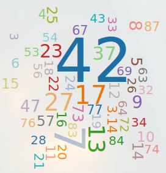

# ChatGPT, Numbers and the Meaning of Life!  

What is the 'favorite' number of ChatGPT?  

This question is in the core of this project.  

---

## Contents {#contents}

- [Contents](#contents)
- [Prologue](#prologue)
- [Synopsis](#synopsis)
- [Process](#process)
    - [Retrieving Raw Data](#retrivieving-the-raw-data)
    - [Processing Raw Data](#processing-the-raw-data)
        - [Overview](#processing-the-raw-data-overview)
        - [Details](#processing-the-raw-data-details)
        - [Attention](#processing-the-raw-data-attention)
    - [Summarizing the Results](#summarizing-the-results)
        - [Overview](#summarizing-the-results-overview)
    - [Visualizing the Results](#visualizing-the-results)
        - [Disclaimer](#visualizing-the-results-disclaimer)
- [Results](#results)
    - [ChatGPT's Favorite Number](#results-top-1)
    - [Top 5 most frequently occuring numbers](#results-top-5)
    - [Top 50 most frequently occuring numbers](#results-top-50)
- [Nerd Mythology and Fun!](#nerd-mythology-and-fun)
- [A Thank You to Vaggos](#a-thank-you-to-vaggos)
- [References](#references)

## Prologue {#prologue}

I was wondering what biases may be revealed by an exploration 
of the most frequently occuring numbers from ChatGPT agent, 
and indeed there are some strong ones in favor of certain numbers.

It is fine to jump directly to the [Results](#results)
or even (better!) to [Nerd Mythology and Fun](#nerd-mythology-and-fun) 
**if you are not interested in the technical details**.

And may you find the result quite amusing too!

[back to Contents](#contents)

 

## Synopsis {#synopsis}

10000 responses were collected from the ChatGPT's API.
In each iteration the agent was requested to 'give a number' 
and the raw response was collected and stored in a database.

The raw data was then processed in order to extract the numbers
and the values got stored in another database.

Finally the results were summarized and visualized.

[back to Contents](#contents)

 

## Process {#process}

The process can be thought as four major

### Retrieving the Raw Data {#retrivieving-the-raw-data}

The script 'retrieve_raw_data.py' was used to collect the data.
When it runs, it asks the user for the number of raw responses that should be gathered.

To achieve it, it communicates with the ChatGPT through the available API.

It is required for the user to already have access to the API 
and to put his API key in a file called 'config.py' 
which will contain one line:
> api_key = \<the-api-key-of-the-user\\>

(this file was not included in the repo 
to hide the API key used for the project, 
which is my personal one!)

At each iteration the raw response get's stored 
as-is in an SQL Lite DB (called 'rawdb.sqlite').

[back to Process](#process)

### Processing the Raw Data {#processing-the-raw-data}

The script 'prossess_raw_data.py' was used to process the data.

#### Overview {#processing-the-raw-data-overview}

The raw responses (that were gathered in the previous phase),
needed to be processed as the agent returned them in various non-standard formats.

The responses got cleaned and the number of each response was extracted
and got stored in another SQL Lite DB.

[back to Processing the Raw Data](#processing-the-raw-data)  
[back to Process](#process)  

#### Details {#processing-the-raw-data-details}

Most of the numbers were in a good format, 
meaning that they contained just a positive integer number.

Sometimes big integer numbers had a comma in the thousands,
which needed to get eliminated.

In many cases the number was followed by a single dot,
which needed to be ommitted.

Also very frequently the numbers were accompanied by some text 
from which they needed to got extracted.

In one case the number 12 was return as text, 'twelve',
which got converted to the number 12.

One response contained 3 numbers, from which only the first got counted as valid
and ectracted.

Only one floating point number occured, pi which was given in 
variations of decimal digits. It was decided to round it to 2 
so that all cases will correctly count as 3.14.

[back to Processing the Raw Data](#processing-the-raw-data)  
[back to Process](#process)  

#### Attension {#processing-the-raw-data-attention}

The cleaning phase is not fully robust, as the process may fail 
if one uses the script 'retrieve_raw_data.py 'to collect new data. 

It is possible that there will be needed to manually 
inspect the data in order to identify and handle some unexpected anomalies 
that were not encountered in this project.

When the script runs it deletes the 'numbersdb.sqlite' DB 
and creates a new one from the 'rawdb.sqlite' DB. Care!
It is suggested to comment out the relevant line from 'main.py'
once you have the raw data processed.

[back to Processing the Raw Data](#processing-the-raw-data)  
[back to Process](#process)  
[back to Contents](#contents)  

### Summarizing the Results {#summarizing-the-results}

The script 'summarize_results.py' was used to summarize the results.

[back to Process](#process)  
[back to Contents](#contents)  

#### Overview {#summarizing-the-results-overview}

The results were summarized in order to identify those numbers 
that occurred more often as well as their frequency.

[back to Summarizing the Results](#summarizing-the-results)  
[back to Process](#process)  
[back to Contents](#contents)  

### Visuallizing the Results {#visualizing-the-results}

The script 'visualize_results' was used to visuallize the results,
which takes into acount the occurances of each number 
and produces the normalized sizes of the numbers 
that got stored in the file 'wordcloud.js'.

Then the numbers get plotted in wordcloud,
using the file 'wordcloud.htm', 
that can be opened in the browser to 
visually examine the top 50 most frequently occuring numbers.

[back to Process](#process)  
[back to Contents](#contents)  

#### Disclaimer {#visualizing-the-results-disclaimer}

These three scripts that were used for the visuallization, 
were taken almost as is from contents of the courses and correspond to the 

files:  
1. 

from the repo:
> https://github.com/...

[back to Visualizing the Results](#visualizing-the-results)  
[back to Process](#process)  
[back to Contents](#contents)  

 

## Results {#results}

The most frequently occuring, the top 5 and the top 50 numbers 
are presented along with their frequency from a sample of 10000 observations.

### ChatGPT's Favorite Number {#resutls-top-1}

ChatGPT's favorite number is.. 42!! 
It was returned of 21.69% times out of the 10000 requests.

### Top 5 most frequently occuring numbers {#results-top-5}

The five most frequently occuring numbers, aggregated,
constitute 52.48% of the sample with 10000 observations.

Specifically:

1. The number 42 occured 21.69% of times.  
2. The number 7 occured 13.91% of times.  
3. The number 17 occured 6.15% of times.  
4. The number 27 occured 5.45% of times.  
5. The number 13 occured 5.28% of times.  

### Top 50 most frequently occuring numbers {#results-top-50}

The following numbers are the 50 most frequently occuring:

>  3.14  
>  3,  4,  5,  6,  7,  8,  9,  
> 10, 11, 12, 13, 14, 15, 16, 17, 18, 19,  
> 20, 21, 22, 23, 24, 25, 26, 27, 28,   
> 32, 33, 34, 37, 42, 43, 47,  
> 53, 54, 56, 57,  
> 63, 64, 67, 69,  
> 72, 73, 74, 76, 77,  
> 83, 84, 87
 
The following figure displays them with size proportianal
to the relative frequency of each number. 

Finally the following table displays the relative frequency of each number. 

|Number | Frequency (%)|
|-------|--------------|
|42     |21.69         |
|7      |13.91         |
|17     | 6.15         |
|27     | 5.45         |
|13     | 5.28         |
|37     | 3.37         | 
|23     | 2.94         |
|8      | 2.48         |
|9      | 2.44         |
|47     | 2.07         |
|5      | 1.62         |
|14     | 1.49         |
|73     | 1.44         |
|10     | 1.31         |
|57     | 1.29         |
|12     | 1.27         |
|25     | 1.09         |
|15     | 1.09         |
|21     | 0.87         |
|6      | 0.83         |
|77     | 0.73         |
|24     | 0.73         |
|3.14   | 0.72         |
|87     | 0.69         |
|16     | 0.63         |
|4      | 0.63         |
|22     | 0.62         |
|11     | 0.59         |
|67     | 0.53         |
|18     | 0.48         |
|26     | 0.48         |
|64     | 0.47         |
|33     | 0.45         |
|32     | 0.44         |
|63     | 0.43         |
|56     | 0.43         |
|72     | 0.43         |
|83     | 0.36         |
|43     | 0.35         |
|54     | 0.34         |
|28     | 0.33         |
|19     | 0.31         |
|20     | 0.30         |
|76     | 0.29         |
|84     | 0.29         |
|53     | 0.28         |
|34     | 0.28         |
|74     | 0.26         |
|69     | 0.26         |
|3      | 0.25         |

[back to Results](#results)
[back to Contents](#contents)

  

## Nerd Mythology and Fun! {#nerd-mythology-and-fun}

..42!! Really 42..

Although there is no doupt that the agent is of narrow intelligence, 
giving back this number is quite funny if one takes into account the 
classic novel 'HitchHikers's Guide to the Galaxy' according to which..

.. SPOILER ALERT ..

.. 42 is The Meaning of Life! 

Isn't the irony quite apparent! 

Having a bot that is one step behind passing the 'Turing Test' 
giving this iconic number back in such frequency makes the imagination tick.
Does the bot hides something?? Is it some code for his fellow bots or a message for humanity?
For sure a decent 'Black Mirror' episode could be made out of this! 

[back to Contents](#contents)

 

## A Thank You to Vaggos! {#a-thank-you-to-vaggos}

My friend who knew and brought to my aweraness the story around 42.

[back to Contents](#contents)

 

## References {#references}

Python Software Foundation. Python Language Reference, version 2.7. Available at http://www.python.org

[back to Contents](#contents)

 
